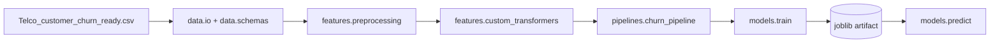

# Plano de ação — Etapa 3 (Itens 1 e 2)

## Objetivo
Concluir apenas:
- Item 1: refatoração para estrutura modular em `src/`.
- Item 2: pipeline reprodutível com `scikit-learn` + transformadores custom.

Sem perder nada do que já existe (notebooks, dados, MLflow local e documentação), mantendo aderência às regras em [`.github/context/tech-stack.md`](D:/Projetos/FIAP/Tech%20Challenge%2001/9mlet-tech-challenge-1-churn-prevision/.github/context/tech-stack.md), [`.github/rules/code-style.md`](D:/Projetos/FIAP/Tech%20Challenge%2001/9mlet-tech-challenge-1-churn-prevision/.github/rules/code-style.md), [`.github/libs/allowed-libs.md`](D:/Projetos/FIAP/Tech%20Challenge%2001/9mlet-tech-challenge-1-churn-prevision/.github/libs/allowed-libs.md) e [`.github/libs/forbidden-libs.md`](D:/Projetos/FIAP/Tech%20Challenge%2001/9mlet-tech-challenge-1-churn-prevision/.github/libs/forbidden-libs.md).

## Princípios de execução
- Refatoração incremental: extrair lógica dos notebooks sem apagá-los.
- Compatibilidade: manter caminho e contrato do dataset atual (`data/Telco_customer_churn_ready.csv`).
- Reprodutibilidade: `random_state` fixo, pipeline único para treino/inferência, serialização versionada.
- Boas práticas atuais: APIs modernas do `scikit-learn` (`Pipeline`, `ColumnTransformer`), tipagem e lint com `ruff`.
- Escopo estrito: sem implementar itens 3–6 agora.

## Arquitetura alvo (itens 1 e 2)
- Código principal em `src/churn/`.
- Separação mínima por domínio:
  - `src/churn/data/` (I/O e contrato de colunas)
  - `src/churn/features/` (pré-processamento e transformadores custom)
  - `src/churn/pipelines/` (montagem do pipeline fim-a-fim)
  - `src/churn/models/` (treino/persistência/inferência)
  - `src/churn/config.py` (constantes e parâmetros)

## Fases de implementação

### Fase A — Baseline seguro e inventário técnico
- Mapear no notebook atual (`notebooks/03_mlp_pytorch.ipynb`) e no dataset pronto quais colunas são:
  - features de entrada,
  - target (`Churn Value`),
  - colunas excluídas.
- Congelar um contrato inicial de dados (nomes/tipos esperados) em módulo de schema.
- Definir estratégia de preservação: notebooks continuam funcionando durante a migração.

### Fase B — Estrutura `src/` (Item 1)
- Criar estrutura modular mínima em `src/churn/` com `__init__.py`.
- Extrair funções reutilizáveis primeiro:
  - leitura do dataset,
  - split estratificado,
  - utilitários de seed/config.
- Mover pré-processamento para módulo dedicado (sem alterar comportamento funcional).
- Criar entradas de execução por módulo (`python -m ...`) para treino e predição local.

### Fase C — Pipeline reprodutível sklearn (Item 2)
- Implementar `ColumnTransformer` com blocos numéricos/categóricos.
- Encadear em `Pipeline` com estimador sklearn inicial (baseline estável para engenharia).
- Criar transformadores custom apenas para regras reais do dataset (evitar complexidade desnecessária).
- Persistir pipeline completo com `joblib` (pré-processamento + modelo no mesmo artefato).
- Garantir carregamento do artefato e predição em lote e unitária.

### Fase D — Compatibilidade e documentação operacional
- Adaptar notebook(s) para consumir funções de `src` (sem remover células históricas úteis).
- Documentar fluxo de uso mínimo:
  - treino do pipeline,
  - salvamento do artefato,
  - inferência com artefato salvo.
- Validar aderência às libs permitidas e evitar qualquer tecnologia restrita.

### Fase E — Atualização do TODO da etapa
- Atualizar [`docs/TODO_ETAPA_3.MD`](D:/Projetos/FIAP/Tech%20Challenge%2001/9mlet-tech-challenge-1-churn-prevision/docs/TODO_ETAPA_3.MD) apenas nos itens 1 e 2:
  - status,
  - entregáveis realmente concluídos,
  - observações de fechamento técnico.
- Manter itens 3–6 como pendentes.

## Critérios de aceite (somente itens 1 e 2)
- Existe estrutura `src/churn/` organizada e reutilizável.
- Treino e inferência rodam sem depender de execução manual de notebook.
- Pipeline sklearn (`ColumnTransformer` + `Pipeline`) está modularizado.
- Artefato joblib do pipeline completo é salvo e recarregado com sucesso.
- Nenhum conteúdo prévio essencial foi perdido (notebooks, docs, MLflow local, dataset).
- `docs/TODO_ETAPA_3.MD` atualizado refletindo apenas os avanços de 1 e 2.

## Riscos e mitigação
- Risco: divergência entre notebook e `src`.
  - Mitigação: notebooks passam a chamar `src` gradualmente.
- Risco: leakage em preprocessing.
  - Mitigação: `fit` só no treino e `transform` fora do treino via pipeline único.
- Risco: refatoração quebrar entrega acadêmica em andamento.
  - Mitigação: commits lógicos por fase e preservação dos notebooks como trilha de evidência.

## Resultado esperado
Concluir os itens 1 e 2 com padrão de engenharia compatível com um trabalho de pós em Engenharia de ML: código modular, reprodutível, auditável e pronto para ser conectado à API nas próximas tarefas.