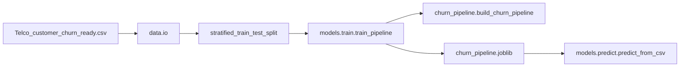

# Documentação final — Etapa 3, Itens 1 e 2 (refatoração + pipeline sklearn)

## 1. Objetivo e escopo desta entrega

Esta documentação descreve **o que foi implementado** na Etapa 3 do Tech Challenge, **limitando-se aos Itens 1 e 2**:

| Item | Descrição |
|------|-----------|
| **1** | Refatoração do projeto em módulos Python sob `src/`, com estrutura clara e responsabilidades separadas. |
| **2** | Pipeline reprodutível com **scikit-learn** (`Pipeline`, `ColumnTransformer`) e **transformador custom** (`TotalChargesCleaner`), com treino, persistência e inferência fora dos notebooks. |

**Fora de escopo nesta entrega:** testes automatizados (`pytest`, `pandera`), API FastAPI, logging estruturado, middleware, `pyproject.toml`, `Makefile` — permanecem planejados nos itens 3 a 6 do [TODO_ETAPA_3.MD](TODO_ETAPA_3.MD).

---

## 2. Resumo executivo do que foi feito

1. **Pacote `churn`** criado em `src/churn/`, importável após adicionar `src` ao `PYTHONPATH` (ou executar a partir da raiz com `python -m` configurado corretamente).
2. **Camada de dados:** leitura do CSV pronto, resolução de caminho padrão, split estratificado e validação mínima do alvo.
3. **Camada de features:** pré-processamento com `ColumnTransformer` (numérico + categórico) e transformador custom alinhado ao EDA original (`Total Charges`).
4. **Camada de pipelines:** montagem de um único `sklearn.pipeline.Pipeline` (limpeza → pré-processamento → estimador).
5. **Camada de modelos:** treino com métricas no holdout, serialização com **joblib**, metadados em **JSON**, e script de predição em lote a partir de CSV.
6. **Integração com notebook:** o [notebooks/03_mlp_pytorch.ipynb](../notebooks/03_mlp_pytorch.ipynb) foi **estendido** (células novas) para importar `churn` e instanciar o pipeline sklearn, **sem remover** o fluxo didático PyTorch existente.

Nada do repositório anterior foi apagado por esta refatoração: notebooks, `data/`, MLflow em `notebooks/` e documentação em `docs/` permanecem como base histórica e de experimentação.

---

## 3. Estrutura final de diretórios (`src/churn`)

Árvore lógica do que foi desenvolvido:

```text
src/
└── churn/
    ├── __init__.py
    ├── config.py
    ├── data/
    │   ├── __init__.py
    │   ├── io.py              # Caminhos, leitura CSV, split estratificado
    │   └── schemas.py         # Contrato de dados, validação do alvo, REMOVED_COLUMNS_FROM_RAW
    ├── features/
    │   ├── __init__.py
    │   ├── preprocessing.py   # ColumnTransformer (num + cat)
    │   └── custom_transformers.py  # TotalChargesCleaner
    ├── pipelines/
    │   ├── __init__.py
    │   └── churn_pipeline.py  # build_churn_pipeline, build_estimator
    └── models/
        ├── __init__.py
        ├── train.py           # train_pipeline + CLI
        ├── predict.py         # predict_from_csv + CLI
        ├── registry.py        # joblib dump/load + metadata.json
        └── evaluate.py        # Métricas de classificação no teste
```

**Artefatos gerados pelo treino (não versionados por padrão):**

```text
models/sklearn/
├── churn_pipeline.joblib   # Pipeline completo (fit)
└── metadata.json           # Parâmetros, contagens, métricas, timestamp UTC
```

Recomenda-se incluir `models/sklearn/*.joblib` e artefados grandes no `.gitignore` se a política do time for não versionar pesos locais.

---

## 4. Fluxo de dados (visão técnica)



1. **Entrada:** CSV gerado pelo EDA (`Telco_customer_churn_ready.csv`), com coluna alvo `Churn Value`.
2. **Treino:** `fit` apenas no conjunto de treino; métricas avaliadas no conjunto de teste (sem vazamento do split).
3. **Saída:** arquivo joblib com **todo** o encadeamento (transformações + modelo), reproduzível na inferência.

---

## 5. Descrição detalhada por módulo

### 5.1 `churn/config.py`

| Símbolo | Função |
|---------|--------|
| `DEFAULT_SEED` | Semente padrão (`42`) para reprodutibilidade. |
| `TARGET_COLUMN` | Nome da coluna alvo: `"Churn Value"`. |
| `DEFAULT_DATA_PATH_CANDIDATES` | Caminhos relativos tentados na ordem: `data/...`, `../data/...` (compatível com execução na raiz do repo ou a partir de `notebooks/`). |
| `TrainingConfig` | Dataclass com defaults: `test_size=0.2`, `estimator_name="logistic_regression"`, `output_dir=models/sklearn`, etc. |

### 5.2 `churn/data/schemas.py`

- **`REMOVED_COLUMNS_FROM_RAW`:** documenta colunas removidas no notebook de EDA (referência de contrato; o CSV *ready* já vem sem elas).
- **`DatasetContract`:** dataclass com metadados do contrato (alvo, colunas de identificação, colunas pós-evento).
- **`validate_ready_dataset`:** garante presença do alvo, ausência de nulos no alvo e tipo numérico.
- **`split_features_target`:** separa `X` (features) e `y` (inteiro).

### 5.3 `churn/data/io.py`

| Função | Descrição |
|--------|-----------|
| `resolve_data_path` | Resolve caminho explícito ou primeiro candidato existente. |
| `load_ready_dataset` | `pd.read_csv` no arquivo resolvido. |
| `load_features_target` | Carrega e retorna `(features, target)`. |
| `stratified_train_test_split` | `sklearn.model_selection.train_test_split` com `stratify=target`. |

### 5.4 `churn/features/custom_transformers.py`

- **`TotalChargesCleaner`:** herda `BaseEstimator` e `TransformerMixin`.
  - Converte a coluna `Total Charges` para numérico com `errors="coerce"` e preenche ausentes com `0.0`, espelhando a lógica do EDA.
  - Se a coluna não existir (por exemplo, em variante futura do dataset), o passo é no-op para essa coluna.

### 5.5 `churn/features/preprocessing.py`

- **`infer_column_groups`:** classifica colunas em numéricas/booleanas vs demais (tratadas como categóricas).
- **`build_preprocessor`:** monta um `ColumnTransformer` com:
  - **Numérico:** `SimpleImputer(median)` → `StandardScaler`.
  - **Categórico:** `SimpleImputer(most_frequent)` → `OneHotEncoder(handle_unknown="ignore")`.
  - `remainder="drop"`, `sparse_threshold=0.0` para saída densa compatível com estimadores downstream.

**Nota sobre o dataset atual:** o arquivo `Telco_customer_churn_ready.csv` produzido pelo notebook de EDA já está em grande parte **numérico one-hot**. Nesse caso, a maioria das colunas cai no ramo numérico; o ramo categórico pode ficar vazio — comportamento aceito pelo scikit-learn nas versões recentes. Se no futuro você passar um DataFrame com colunas `object` antes do encoding, o mesmo código aplicará one-hot corretamente.

### 5.6 `churn/pipelines/churn_pipeline.py`

| Função | Descrição |
|--------|-----------|
| `build_estimator` | Instancia `LogisticRegression` ou `RandomForestClassifier` com `class_weight="balanced"`, `random_state` fixo e `n_jobs=1` (estável no Windows). |
| `build_churn_pipeline` | Retorna `Pipeline([("clean_total_charges", ...), ("preprocessor", ...), ("estimator", ...)])`. |

### 5.7 `churn/models/evaluate.py`

- **`classification_metrics`:** calcula `accuracy`, `precision`, `recall`, `f1` e, se houver probabilidades, `roc_auc`.

### 5.8 `churn/models/registry.py`

- **`save_pipeline_artifact`:** grava `churn_pipeline.joblib` e `metadata.json` (timestamp UTC ISO, hiperparâmetros, métricas, contagens).
- **`load_pipeline_artifact`:** `joblib.load` — usar apenas com artefatos **confiáveis** (gerados pelo próprio projeto). Carregar pickles de terceiros é prática insegura e vai contra as diretrizes de segurança do repositório.

### 5.9 `churn/models/train.py`

- **`train_pipeline(...)`:** orquestra carga, split, `fit`, métricas no teste e salvamento.
- **CLI:** `python -m churn.models.train` com flags `--data-path`, `--estimator-name`, `--output-dir`, `--test-size`, `--random-state`.  
  **Requisito:** diretório de trabalho e `PYTHONPATH` devem permitir importar o pacote `churn` (veja seção 7).

### 5.10 `churn/models/predict.py`

- **`predict_from_csv`:** carrega pipeline, lê CSV de **features** (sem coluna alvo), retorna `DataFrame` com `prediction` e `probability_churn`.
- **CLI:** `--model-path`, `--input-path`, `--output-path`, `--threshold`.

---

## 6. Contrato de dados esperado

- **Arquivo:** `Telco_customer_churn_ready.csv` (ou caminho passado explicitamente).
- **Coluna alvo obrigatória para treino:** `Churn Value` (binária, valores numéricos inteiros).
- **Features:** todas as demais colunas do CSV após drop do alvo.
- **Alinhamento com EDA:** o notebook [01_eda.ipynb](../notebooks/01_eda.ipynb) documenta limpeza, encoding e exportação desse arquivo; o módulo `schemas` documenta colunas removidas na fase bruta.

---

## 7. Como executar (ambiente e comandos)

### 7.1 Pré-requisitos

- Python com dependências do [requirements.txt](../requirements.txt) instaladas (`pandas`, `scikit-learn`, `joblib` transitivo via sklearn, etc.).
- Arquivo de dados presente em `data/Telco_customer_churn_ready.csv` (ou informe `--data-path`).

### 7.2 Variável `PYTHONPATH`

Na raiz do repositório (pasta que contém `src/`):

**Windows (PowerShell):**

```powershell
$env:PYTHONPATH = "src"
python -m churn.models.train
```

**Linux/macOS:**

```bash
PYTHONPATH=src python -m churn.models.train
```

### 7.3 Treinar e salvar artefatos

```powershell
$env:PYTHONPATH = "src"
python -m churn.models.train --estimator-name logistic_regression --output-dir models/sklearn
```

Opção de estimador: `random_forest`.

Saída padrão: JSON no stdout com `model_path`, `metadata_path` e `metrics`.

### 7.4 Predizer a partir de CSV

O CSV de entrada deve conter **as mesmas colunas de features** usadas no treino (sem `Churn Value`).

```powershell
$env:PYTHONPATH = "src"
python -m churn.models.predict --model-path models/sklearn/churn_pipeline.joblib --input-path caminho/para/features.csv --output-path predictions.csv --threshold 0.5
```

---

## 8. Integração com o notebook `03_mlp_pytorch.ipynb`

Foram adicionadas células ao final do notebook que:

1. Ajustam `sys.path` para incluir `<raiz_do_projeto>/src`.
2. Importam `load_features_target` e `build_churn_pipeline`.
3. Instanciam o pipeline sklearn com `DATA_PATH` já definido nas células anteriores.

Assim, o notebook continua como **laboratório PyTorch** e passa a **referenciar** a mesma base de engenharia que a API e scripts usarão depois, reduzindo divergência entre experimentação e código modular.

---

## 9. Relação com o restante do projeto (MLP, MLflow, baselines)

| Componente | Papel após esta entrega |
|------------|-------------------------|
| Notebooks 01–06 | Continuam como fonte de EDA, baselines, MLP PyTorch, comparação e trade-off de custo; não foram substituídos. |
| MLflow em `notebooks/` | Continua registrando experimentos dos notebooks; o pipeline sklearn em `src` pode ser integrado ao MLflow em etapa futura. |
| MLP PyTorch | Requisito acadêmico do desafio permanece nos notebooks; o pipeline em `src` prioriza **engenharia reprodutível** com sklearn, alinhado ao [GUIA_ETAPA3_ITENS_1_2.md](GUIA_ETAPA3_ITENS_1_2.md). |

---

## 10. Aderência às regras do repositório (`.github/` / `.cursor/`)

- **Stack:** uso de `scikit-learn`, `pandas`, `joblib` está alinhado a [`.github/libs/allowed-libs.md`](../.github/libs/allowed-libs.md) e [`.github/context/tech-stack.md`](../.github/context/tech-stack.md).
- **Estilo:** nomes de código em inglês; documentação de usuário em pt-BR, consistente com [`.github/rules/code-style.md`](../.github/rules/code-style.md).
- **Segurança:** evitar carregar pickles não confiáveis — alinhado a [`.github/libs/forbidden-libs.md`](../.github/libs/forbidden-libs.md).

---

## 11. Rastreabilidade acadêmica

Para relatório ou banca, você pode citar:

1. **Objetivo da refatoração:** separar experimentação (notebooks) de artefato reprodutível (`src` + joblib).
2. **Critério de reprodutibilidade:** mesmo seed, mesmo split estratificado, um único objeto `Pipeline` serializado.
3. **Evidência:** `metadata.json` com data UTC, hiperparâmetros e métricas no holdout.

---

## 12. Próximos passos sugeridos (itens 3–6)

Documentados em [TODO_ETAPA_3.MD](TODO_ETAPA_3.MD): testes (`pytest`, `pandera`), API FastAPI, logging, middleware de latência, `pyproject.toml`, `ruff`, `Makefile`.

---

## 13. Documentação relacionada

| Documento | Conteúdo |
|-----------|----------|
| [TODO_ETAPA_3.MD](TODO_ETAPA_3.MD) | Status da Etapa 3 por item. |
| [GUIA_ETAPA3_ITENS_1_2.md](GUIA_ETAPA3_ITENS_1_2.md) | Guia conceitual leigo + técnico para itens 1 e 2. |
| [TODO.md](TODO.md) | Roadmap histórico em notebooks (Etapas anteriores). |
| [METRICAS.md](METRICAS.md) | Métricas e visão de negócio. |

---

*Documento gerado para fechamento da documentação da refatoração (Etapa 3 — Itens 1 e 2). Última revisão alinhada à estrutura de código em `src/churn/`.*
