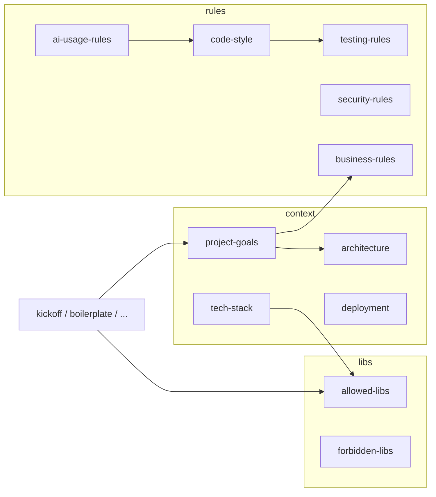

# Relatório técnico: configurações de contexto em `.cursor`

**Projeto:** `9mlet-tech-challenge-1-churn-prevision`  
**Escopo esperado:** Machine Learning para previsão de churn (Tech Challenge FIAP)  
**Stack de referência:** PyTorch, Scikit-Learn, MLflow, FastAPI, pytest, ruff  
**Data da análise:** 28 de março de 2026  

---

## Resumo executivo

A pasta `.cursor` está **estruturada de forma madura** (contexto, regras, bibliotecas, comandos e integração SetAI), porém **grande parte do conteúdo ainda reflete um template genérico** orientado a **Node.js / TypeScript / CLI npm**, e não a um **monorepositório Python de MLOps**.

Os arquivos **`project-goals.md`**, **`business-rules.md`** (em parte) e vários **comandos** incorporam corretamente o domínio de **churn**, **MLP em PyTorch**, **MLflow**, **FastAPI**, **`/predict`**, **ruff** e a estrutura de pastas do desafio. Em contraste, **`tech-stack.md`**, **`architecture.md`**, **`deployment.md`**, **`code-style.md`**, **`ai-usage-rules.md`**, **`allowed-libs.md`** e **`forbidden-libs.md`** **contradizem** essas mesmas restrições ao exigir ou recomendar **ESLint, Prettier, TypeScript, Vitest/Jest, npm** e padrões de **Express/JWT/ORM SQL**.

**Conclusão executiva:** o **índice e a narrativa de negócio** estão bem alinhados ao Tech Challenge; a **camada técnica “fonte da verdade”** (stack, estilo, libs, deploy) está **desalinhada** e pode **induzir a IA e humanos** a gerar código e processos incorretos para este repositório.

**Prioridade de ajustes:** **Alta** — alinhar `tech-stack`, `code-style`, `ai-usage-rules`, `libs/*` e trechos de `architecture` / `security` / `deployment` à stack Python; **Média** — harmonizar testes (pytest, convenções `test_*.py`); **Baixa** — revisar duplicação de texto entre `project-goals`, `business-rules` e comandos.

---

## 1. Inventário dos arquivos

Árvore sob `.cursor` (27 arquivos em 5 subpastas + raiz):

| Caminho | Extensão | Função aparente | Categoria |
|---------|----------|-----------------|-----------|
| `.cursor/README.md` | `.md` | Índice da pasta, princípios de uso humano/IA | Documentação / onboarding |
| `.cursor/context/architecture.md` | `.md` | Decisões arquiteturais, padrões, escalabilidade | Contexto persistente |
| `.cursor/context/deployment.md` | `.md` | Infra, CI/CD, variáveis de ambiente | Contexto persistente |
| `.cursor/context/project-goals.md` | `.md` | Problema, usuários, objetivos, restrições Tech Challenge | Contexto persistente |
| `.cursor/context/tech-stack.md` | `.md` | Linguagem, ferramentas, dependências | Contexto persistente |
| `.cursor/rules/ai-usage-rules.md` | `.md` | Onde a IA pode atuar, modelos sugeridos, gate de lint | Regras duras |
| `.cursor/rules/business-rules.md` | `.md` | Regras de negócio e restrições do domínio churn | Regras duras |
| `.cursor/rules/code-style.md` | `.md` | Lint, formatação, idioma código/comentários | Regras duras |
| `.cursor/rules/git-rules.md` | `.md` | Commits, branches, PRs | Regras duras |
| `.cursor/rules/security-rules.md` | `.md` | Auth, validação, dependências seguras | Regras duras |
| `.cursor/rules/testing-rules.md` | `.md` | TDD, pirâmide, cobertura, exemplos | Regras duras |
| `.cursor/libs/ai-models.md` | `.md` | Modelos de IA permitidos por fase | Política de ferramentas |
| `.cursor/libs/allowed-libs.md` | `.md` | Bibliotecas permitidas (atualmente ecossistema Node/CLI) | Política de dependências |
| `.cursor/libs/forbidden-libs.md` | `.md` | Bibliotecas proibidas (CLI/TS) | Política de dependências |
| `.cursor/commands/architecture-review.md` | `.md` | Prompt para revisão arquitetural | Automação / template de comando |
| `.cursor/commands/challenge-solution.md` | `.md` | Prompt para contestar soluções propostas | Automação |
| `.cursor/commands/extract-business-rules.md` | `.md` | Extração de regras de negócio | Automação |
| `.cursor/commands/generate-boilerplate.md` | `.md` | Geração de boilerplate alinhado ao projeto | Automação |
| `.cursor/commands/generate-docs.md` | `.md` | Geração de documentação técnica | Automação |
| `.cursor/commands/kickoff-project.md` | `.md` | Kickoff de requisitos e arquitetura inicial | Automação |
| `.cursor/commands/pre-deploy-validation.md` | `.md` | Checklist pré-deploy | Automação |
| `.cursor/commands/refactor-controlled.md` | `.md` | Refatoração controlada | Automação |
| `.cursor/commands/review-pr.md` | `.md` | Revisão de PR | Automação |
| `.cursor/commands/test-strategy.md` | `.md` | Estratégia de testes | Automação |
| `.cursor/.setai/config.json` | `.json` | Chaves de API (placeholders) e idioma pergunta/arquivo | Configuração externa / gerador |
| `.cursor/.setai/README.md` | `.md` | Avisos sobre SetAI e paths de config | Documentação |
| `.cursor/.setai/.gitignore` | (sem ext.) | Ignora `config.json` no commit da cópia local | Proteção / git |

**Observação:** Não há arquivos `rules` no formato legado `.cursorrules` na raiz de `.cursor` analisada; a governança concentra-se em Markdown sob `rules/`, `context/` e `libs/`.

---

## 2. Resumo do propósito de cada arquivo e impacto no Cursor

### 2.1 Raiz e documentação geral

- **`README.md`:** Mapa mental da pasta (context → rules → libs → commands), princípios (“regras duras”, contexto explícito). **Impacto:** orienta humanos e modelos que leem essa árvore a priorizar `rules/` antes de sugerir código.

### 2.2 `context/`

- **`project-goals.md`:** Fonte rica de alinhamento ao **churn**, **PyTorch/MLP**, **baselines Sklearn**, **MLflow**, **FastAPI**, **ruff**, **`/predict`**, **Model Card**, dataset ≥5k×10 features. **Impacto:** positivo e específico ao desafio.
- **`tech-stack.md`:** Deveria consolidar a stack; na prática lista **Node**, **ESLint/Prettier/TS**, **Vitest/Jest**, placeholders **`Nenhum`**, **`templates.none`**, versão **`0.1.0`** sem semântica Python. **Impacto:** alto risco de desvio de stack.
- **`architecture.md`:** Mistura descrição correta do produto com **template REST + DB “templates.none”**, **JWT/RBAC**, **Express/helmet**, **Redis/cache**, **npm registry**. **Impacto:** conflito direto com API de inferência sem o desenho de dados descrito nos goals.
- **`deployment.md`:** Quase integralmente focado em **publicação npm**, `npm version`, `package.json`, ambientes npm beta/latest. **Impacto:** irrelevante ou prejudicial ao fluxo Python (venv, `uv`/`pip`, container opcional, `pytest` aparece só como item solto no pipeline).

### 2.3 `rules/`

- **`code-style.md`:** Exige **ESLint + Prettier + TypeScript + scripts em package.json** antes de desenvolver; o cabeçalho diz **Language: Python** e **Framework: Nenhum**. **Impacto:** regra internamente contraditória; bloqueia aderência ao **ruff** prometido em `project-goals`.
- **`testing-rules.md`:** TDD e cobertura bem definidos; exemplos e convenções são **TypeScript/Jest-like** (`*.test.ts`, `describe/it/expect`). Há placeholder `{{TEST_COVERAGE}}`. **Impacto:** bons princípios; sintaxe e ferramentas precisam ser Python/pytest.
- **`git-rules.md`:** Convenções de commit e PR genéricas mas aplicáveis; tipo **REST API** é genérico. **Impacto:** neutro/positivo.
- **`security-rules.md`:** JWT obrigatório, ORM SQL, Express, **templates.none** — desalinhado a API de scoring que pode ser **sem auth** no escopo acadêmico ou com API key simples. **Impacto:** pode forçar complexidade desnecessária ou stack errada.
- **`ai-usage-rules.md`:** Boa governança (IA não decide segurança sozinha); porém **“Lint obrigatório: ESLint + Prettier + tsconfig”** repete o desvio TypeScript. **Impacto:** reforça erro de stack.
- **`business-rules.md`:** Mescla corretamente constraints do Tech Challenge com regras genéricas REST (“todos endpoints autenticados”, transações de BD). **Impacto:** a parte churn/ML é forte; API/DB genéricos competem com non-goals.

### 2.4 `libs/`

- **`allowed-libs.md` / `forbidden-libs.md`:** Listas centradas em **CLI Node** (Commander, Inquirer, Vitest, tsup, pnpm). **Impacto:** se a IA obedecer estritamente, **sugerirá dependências erradas** para PyTorch/FastAPI.
- **`ai-models.md`:** Política de modelos LLM por fase; contexto do projeto ainda cita **Python + Nenhum + templates.none**. **Impacto:** útil para escolha de modelo; metadados de stack devem ser corrigidos.

### 2.5 `commands/` (templates de prompt)

Função comum: instruções reutilizáveis para o Cursor (slash commands ou cópia manual). Vários incluem **Project Context** com stack **`Python + Nenhum + templates.none`** — placeholder não substituído — enquanto embutem o parágrafo longo de constraints ML do desafio.

- **`kickoff-project.md`:** Útil, mas **Project-Specific Notes** falam em “REST + Nenhum + DB” em vez de **pipeline ML + FastAPI**.
- **`generate-boilerplate.md`:** Referencia `allowed-libs` / `forbidden-libs` **atualmente incorretos** para Python.
- Demais (`architecture-review`, `test-strategy`, `review-pr`, etc.): estrutura genérica aceitável; dependem do contexto corrigido.

### 2.6 `.setai/`

- **`config.json`:** Placeholders `anthropic-key`, `google-key`, `openai-key`; idioma perguntas `pt-BR`, arquivos `en`.
- **`README.md`:** Alerta para não commitar segredos; menciona chaves “reais” — no repositório atual parecem **placeholders**, mas o risco existe se alguém substituir por valores verdadeiros e commitar.
- **`.gitignore`:** Ignora apenas `config.json` dentro dessa pasta.

### 2.7 Dependências e relações entre arquivos

**Relação crítica:** `project-goals` define **ruff + pytest + Python**; `code-style`, `ai-usage-rules`, `tech-stack`, `allowed-libs` apontam para **Node/TS** — **nó de inconsistência central**.

---

## 3. Validação de aderência ao projeto de churn prediction

### 3.1 Alinhamento com o repositório atual

O repositório, no momento da análise, é **mínimo** (README curto, sem `pyproject.toml`/`requirements.txt` visível na árvore principal). As regras em `.cursor` **ainda não têm código para validar** (ruff/pytest no CI). Isso amplifica o risco: a **única “verdade”** disponível para a IA é o Markdown — que está **fraturado**.

### 3.2 Stack exigida pelo Tech Challenge (checklist)

| Tecnologia / prática | Onde está bem refletido | Onde está fraco ou conflitante |
|---------------------|-------------------------|--------------------------------|
| **PyTorch** | `project-goals`, `business-rules`, comandos | `tech-stack`, `architecture`, `libs` |
| **Scikit-Learn** | Idem | Idem |
| **MLflow** | Idem | `deployment` (não menciona artefatos/tracking server) |
| **FastAPI** | Goals / business-rules | `architecture` diz “Nenhum” como framework; `security` puxa Express |
| **pytest** | `deployment` (menção), `testing-rules` (uma linha) | Exemplos e layout de testes são TS; sem `pytest.ini`/`conftest` na doc |
| **ruff** | Goals, business-rules | `code-style` e `ai-usage-rules` mandam ESLint/Prettier/TS |
| **Estrutura modular** (`src/`, `tests/`, etc.) | Goals, business-rules | `architecture` não descreve camadas ML (train vs serve) |
| **Boas práticas ML** (seeds, CV estratificada, logging) | Goals | Pouco em `architecture`/`testing-rules` específico a ML |

### 3.3 Instruções genéricas ou conflitantes (exemplos)

- **Framework “Nenhum”** vs **FastAPI obrigatório** nos goals.
- **Database `templates.none`** e padrões **ORM/SQL** vs projeto centrado em **arquivos/tabular + modelo serializado**.
- **Autenticação JWT obrigatória** em `security-rules` e `business-rules` vs escopo acadêmico e non-goals (sem CRM integrado).
- **Duplicação** do mesmo parágrafo de constraints em vários arquivos: aumenta manutenção e risco de divergência futura.

---

## 4. Riscos e inconsistências

1. **Geração de código na stack errada:** ESLint/Prettier/TS/Vitest nas regras “mandatórias” competem com Python/ruff/pytest.
2. **Over-engineering de segurança:** JWT, RBAC, helmet, ORM podem ser aplicados indevidamente a um serviço simples de `/predict`.
3. **Política de dependências invertida:** `allowed-libs` incentiva ecossistema Node; **PyTorch/MLflow/pydantic** não constam como permitidos explícitos.
4. **Placeholders não resolvidos:** `Nenhum`, `templates.none`, `{{TEST_COVERAGE}}`, `Version: 0.1.0` sem relação com `pyproject`.
5. **`business-rules`:** mistura “transações de banco” e “todos endpoints autenticados” com um projeto que pode **não ter BD de aplicação**.
6. **`.setai/README`:** afirma chaves “reais”; se alguém colar chaves verdadeiras, há risco mesmo com `.gitignore` local (`.cursor` pode ser commitada).
7. **Duplicação de texto longo** entre `project-goals`, `business-rules` e comandos — qualquer edição parcial gera **fontes da verdade divergentes**.

---

## 5. Sugestões de melhoria

1. **Unificar a “fonte da verdade” técnica** em `tech-stack.md`: Python 3.12+ (ou versão fixada), `uv` ou `pip`, **ruff** (lint + format opcional), **pytest**, **FastAPI**, **PyTorch**, **scikit-learn**, **MLflow**, **pydantic**; remover Node/TS como padrão salvo dependência real.
2. **Reescrever `code-style.md` e `ai-usage-rules.md`** para checklist **ruff** (`pyproject.toml` ou `ruff.toml`), formatação (`ruff format` ou Black apenas se política exigir), **mypy opcional**; remover exigência de `package.json` para este projeto.
3. **Substituir `allowed-libs.md` / `forbidden-libs.md`** por listas **Python-first** (numpy/pandas opcional, torch, sklearn, mlflow, fastapi, httpx para testes de API, etc.) e proibições relevantes (ex.: frameworks web concorrentes se quiser padronizar FastAPI).
4. **Refatorar `architecture.md`** para camadas: **dados → treino/experimentos (MLflow) → artefato → serviço FastAPI**; remover DB fictício ou marcar explicitamente “sem BD de negócio no MVP”.
5. **Adequar `deployment.md`** a: ambiente virtual, `pytest`, build de imagem Docker opcional, **sem npm**; CI com GitHub Actions rodando ruff + pytest.
6. **`testing-rules.md`:** exemplos em **pytest**, nomes `test_*.py`, `pytest-cov`, fixtures para dados tabulares sintéticos; substituir `{{TEST_COVERAGE}}` por percentual acordado (ex.: 70%).
7. **`security-rules.md`:** nivelar ao risco: validação de payload (Pydantic), limites de tamanho, **não expor stack traces**, secrets em env; JWT apenas se o escopo passar a exigir.
8. **Comandos:** substituir `Python + Nenhum + templates.none` por **Python + FastAPI + PyTorch + MLflow**; em `kickoff`, notas específicas para **ML** (treino vs inferência).
9. **DRY:** manter parágrafo completo de constraints em **um** arquivo (`project-goals` ou `business-rules`) e nos demais usar **link + resumo de uma linha**.

---

## 6. Recomendações de alterações (arquivo a arquivo)

| Arquivo | O que alterar | Justificativa técnica |
|---------|----------------|------------------------|
| `context/tech-stack.md` | Reescrever para stack Python/ML completa; remover ESLint/Vitest/Node como default; definir versões ou intervalos. | Evita que modelo e devs tratem o projeto como frontend/Node. |
| `context/architecture.md` | Remover `templates.none`, Express, Redis como premissa; documentar fluxo ML + API; framework **FastAPI**. | Coerência com entrega Tech Challenge e com `project-goals`. |
| `context/deployment.md` | Trocar npm publish por fluxo Python; CI com ruff + pytest; opcional Docker. | Deploy descrito hoje é de pacote CLI npm, incorreto. |
| `rules/code-style.md` | Tornar **ruff** mandatório; checklist `pyproject.toml`; remover TS/ESLint como pré-condição. | Alinha regra “dura” ao que os goals já exigem. |
| `rules/ai-usage-rules.md` | Atualizar seção “Padronização obrigatória” para Python/ruff/pytest. | Evita gate falso que “proíbe” uso de IA até existir TS. |
| `rules/testing-rules.md` | Exemplos e naming pytest; menção a `TestClient` FastAPI para testes de API. | Reduz atrito e alucinação de sintaxe Jest. |
| `rules/security-rules.md` | Trocar exemplos Node por Pydantic/FastAPI; JWT opcional por fase. | Segurança relevante sem impor stack errada. |
| `rules/business-rules.md` | Suavizar “todos endpoints autenticados” e regras de BD se não houver BD; manter `/predict` e contrato JSON. | Evita requisitos inexistentes no escopo. |
| `libs/allowed-libs.md` | Lista permitida Python/ML. | Fonte de verdade para sugestões de dependências. |
| `libs/forbidden-libs.md` | Proibições úteis ao Python (ex.: duplicar framework web se FastAPI for padrão). | Consistência com allowed. |
| `libs/ai-models.md` | Corrigir linha “Stack: Python + Nenhum + templates.none” para stack real. | Metadados corretos para seleção de LLM. |
| `commands/*.md` | Atualizar bloco “Stack” e notas específicas (kickoff, boilerplate). | Comandos devem refletir o mesmo sistema que `context/`. |
| `.setai/README.md` | Esclarecer que `config.json` no repo pode ser **placeholder**; reforçar não commitar chaves reais. | Reduz confusão e risco de vazamento. |

---

## Conclusão

### Status atual do contexto

- **Estrutura de pastas e fluxo de leitura (rules → context → libs):** **madura e reutilizável.**
- **Conteúdo técnico consolidado:** **parcialmente correto** — forte em **objetivos de negócio e constraints do desafio**, **fraco ou incorreto** em stack de implementação, estilo, libs e deploy.

### Nível de aderência ao projeto de ML/churn

- **Domínio e requisitos do Tech Challenge (texto em goals/business-rules/comandos):** **alto** (~75–85%).
- **Stack operacional (ferramentas, libs, CI, estilo):** **baixo** (~25–35%) devido ao resíduo **Node/TS/CLI**.

### Prioridade de ajustes

1. **Alta (imediata):** `tech-stack.md`, `code-style.md`, `ai-usage-rules.md`, `allowed-libs.md`, `forbidden-libs.md`.
2. **Média:** `architecture.md`, `deployment.md`, `testing-rules.md`, `security-rules.md`, comandos em `commands/`.
3. **Baixa:** reduzir duplicação entre documentos; afinar `business-rules` para remover suposições de BD/auth; revisar `.setai` apenas para clareza de segurança.

---

*Documento gerado para apoiar decisões futuras de configuração do Cursor neste repositório.*
